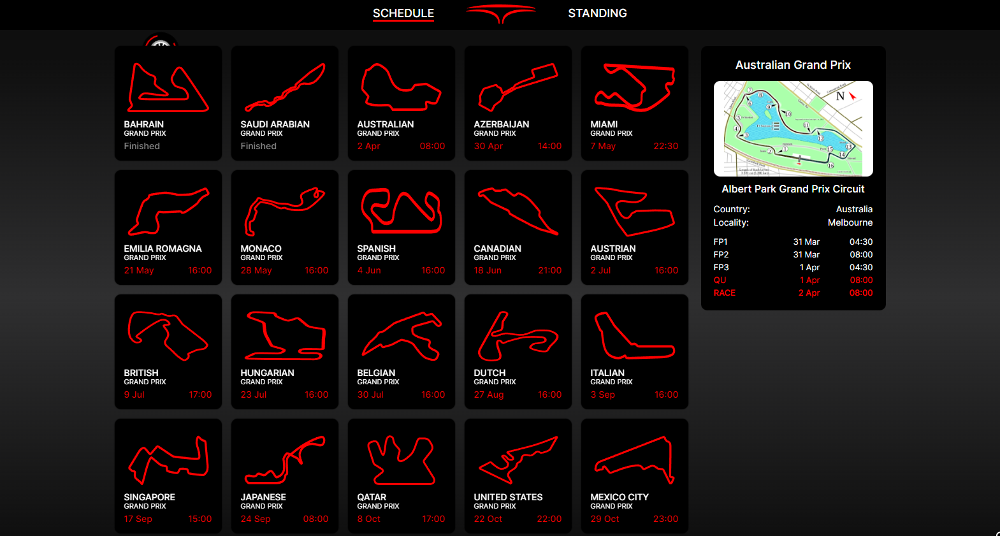
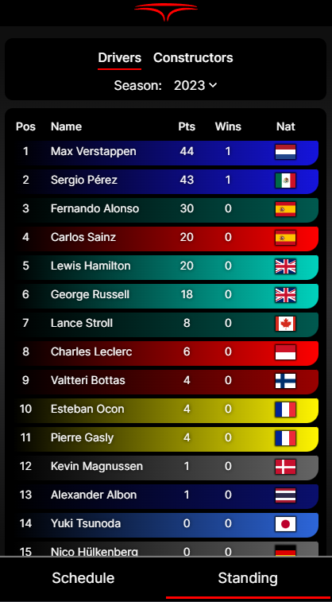

<h2>Formula1 - Schedule & Standings</h2>
<h5>
  <a href="https://formula-schedule.vercel.app/schedule">Website</a>
  with schedule and statistics of Formula 1 races.
</h5>

  

    Desktop version
    
  

  

    Mobile version
    
  

  

    <h4>Used API's</h4>
    <ul>
      <li><a href="https://ergast.com/mrd/">Ergast Developer API</a></li>
      <li><a href="https://api-sports.io/documentation/formula-1/v1">API Sports</a></li>
      <li><a href="https://www.mediawiki.org/wiki/API:Main_page/en">WikiMedia</a></li>
    </ul>
  

  

    <h4>Technology stack</h4>
    <ul>
      <li>TypeScript</li>
      <li>React</li>
      <li>Redux</li>
      <li>SCSS</li>
    </ul>
  

